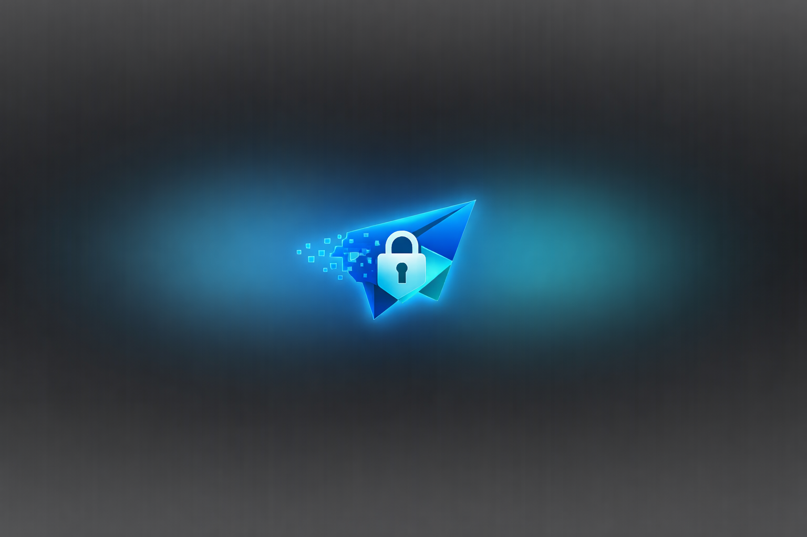

# Ephemra

Ephemra is a self‑hosted, end‑to‑end encrypted messaging platform built with Next.js, Socket.IO, and Prisma. It enables **ephemeral secure chats**, real‑time voice/video calls, and encrypted file transfers without requiring user accounts. All data is encrypted in the browser, ensuring the server never has access to plaintext messages or media.



## Key Features

- **True E2EE** – Messages, files, and calls are encrypted client-side using AES‑GCM.
- **Ephemeral sessions** – Conversations are deleted from the database once they expire.
- **Real‑time communication** – Instant chat, image/video sharing, and WebRTC calls via Socket.IO.
- **File uploads** – Securely send images, videos, and documents (PDF, etc.) with automatic schema creation.
- **No accounts or persistence** – No authentication, no logs; sessions are completely transient.
- **Server‑side database support** – Connects to MySQL, PostgreSQL, SQLite, etc., via Prisma.
- **Custom branding** – Place your own logo in `public/logo.png` and it shows up in the UI.

## Getting Started

1. **Clone the repo**
    ```bash
    git clone <repo-url> ephemra
    cd ephemra
    ```

2. **Install dependencies**
    ```bash
    npm install
    ```

3. **Configure environment**
    Copy `.env.example` to `.env` and set your database credentials:
    ```dotenv
    DB_HOST=...
    DB_PORT=3306
    DB_USER=...
    DB_PASSWORD=...
    DB_NAME=...
    DATABASE_PROVIDER=mysql
    PORT=3002
    NODE_ENV=development
    ```
    The app will build `DATABASE_URL` automatically.

4. **Start development server**
    ```bash
    npm run dev
    ```
    Visit [http://localhost:3000](http://localhost:3000) and click *Start Secure Chat*.

## Deployment

For production:

```bash
npm install --production
npm run build     # runs prisma generate & next build
npm start         # launches custom server with Socket.IO
```

Ensure the `.env` file on the server contains correct credentials. The server will automatically run Prisma migrations or push the schema on startup.

Static file serving for uploaded media is handled by `server.js`.

## Database

Schema is defined in `prisma/schema.prisma` (models: `ChatSession`, `Media`).
During startup the app:

- Constructs `DATABASE_URL` from individual `DB_*` variables
- Applies migrations in production (`prisma migrate deploy`) or pushes schema in development
- Generates Prisma client before building

`src/lib/prisma.ts` further ensures the URL exists and runs `prisma db push` when imported.

## Usage

1. Open the home page and click **Start Secure Chat**.
2. Share the resulting URL (it encodes a shared secret in the hash) with another user.
3. Both parties can exchange encrypted messages or upload files.
4. Files appear on both sides and can be decrypted/previewed inline.
5. Voice/video calling is available via the header buttons.
6. When either user purges or the session expires, all data is deleted from the server.

## Customization

- Replace `public/logo.png` with your own logo.
- Modify UI styles in `src/app/page.tsx`, `src/app/globals.css`.
- Change expiration behaviour or add features via API routes.

## Troubleshooting

- **Cannot send files/videos/PDFs** – ensure `public/uploads` is writable by the server user and the custom server is running (`npm start`).
- **Socket errors (404)** – start the custom `server.js`; the default `next start` doesn't include Socket.IO.
- **Database URL errors** – `.env` must provide `DB_*` values or `DATABASE_URL`.

## License

MIT
